# Contextra Cognitive OS — Systemarchitektur & Ring-Modell

Dieses Dokument ist die maßgebliche technische Architekturbeschreibung des Contextra Cognitive OS. Es übersetzt die normative Gesamtspezifikation (`README.md`) in eine vertiefte Systembeschreibung, dokumentiert den tatsächlichen Crate-Bestand, das Ring-0–4-Modell, die Layering-Invarianten und die bekannten Abweichungen zwischen dem Soll- und Ist-Zustand.

---

## Inhaltsverzeichnis
1. [Ring-Modell (Ring 0–4) & Layering-Invarianten](#1-ring-modell)
2. [Crate-Inventar (Ist-Zustand)](#2-crate-inventar)
3. [Abhängigkeitsdiagramm](#3-abhaengigkeitsdiagramm)
4. [Bekannte Abweichungen IST vs. SOLL](#4-bekannte-abweichungen-ist-vs-soll)
5. [Unsafe-Inseln, Invarianten & Locking-Disziplin](#5-unsafe-inseln-invarianten--locking-disziplin)
6. [Referenzen & Weiterführende Dokumente](#6-referenzen)

---

<a id="1-ring-modell"></a>
## 1. Ring-Modell (Ring 0–4) & Layering-Invarianten

Contextra gliedert seine Funktionalität in ein Fünf-Ring-Schichtenmodell (Ring 0 bis Ring 4). Abhängigkeiten dürfen ausschließlich **von höheren Ringen auf tiefere Ringe** verlaufen. Aufwärtskanten (z. B. ein Ring-0-Crate, das von einem Ring-3-Crate abhängt) sind streng verboten.

### 1.1 Definition der Ringe

* **Ring 0 — Foundation & Pure Numerics / Types**:
  Enthält kerneigenen Datenstrukturen, Typdefinitionen, Traits, Kryptographie, Mathematik, Vektor- und Graph-Primitive. Ring 0 enthält **kein `tokio`** (Grundsatz *Sync-Kern, async-Schale*, P26).
* **Ring 1 — Persistence & Cache**:
  Enthält Persistenz-Engines (LSM-Tree, WAL, Block-Cache, KV-Cache-Segmentdateien) und Time-Travel-Registries. Async-I/O ist an den Grenzen erlaubt.
* **Ring 2 — External Adapters & Sandboxing (Leaf Engines)**:
  Isoliert flüchtige oder externe Schwergewicht-Abhängigkeiten (`candle`, `ollama`, `ort`/ONNX, `wasmtime`). Ring 2 Crates sind Blätter im Graphen und hängen nie von Ring 1 oder 3 ab.
* **Ring 3 — Orchestration & Cognition**:
  Enthält die Geschäfts- und Orchestrierungslogik (Transaktions-Management, Collection-Engine, Synthese, PII-Vault/Privacy Gateway, Profil-Routing, Agent-Workflow).
* **Ring 4 — Boundary & Composition Roots**:
  Öffentliche Fassade (`contextra`), MCP-Server (`contextra-mcp`) und Language-Bindings (`contextra-py`). Bildet die einzige Composition Root.

### 1.2 Verbot von Aufwärtskanten (DAG-Integrität, P5)

Das System erzwingt strikte Directed Acyclic Graph (DAG) Modularität.

**Konkretes Negativ-Beispiel für eine verbotene Aufwärtskante:**
In einer früheren Version hing das Datenbank-Crate `contextra-db` (damals Layer 2 / Ring 3) direkt von `contextra-infer-candle` und `contextra-infer-ollama` (damals Layer 3 / Ring 2) ab, um Embedding-Backends direkt zu instanziieren. Dies verletzte P5, da eine Kern-Engine von konkreten Inferenz-Adaptern abhing.
Im Zielmodell (`ARCHITECTURE.md` / `README.md` §4.2) erhält die Engine stattdessen Trait-Objekte (`Arc<dyn Embedder>`) aus `contextra-ports` (Ring 0), und die konkrete Verdrahtung erfolgt ausschließlich in Ring 4 (`contextra` Fassade).

---

<a id="2-crate-inventar"></a>
## 2. Crate-Inventar (Ist-Zustand)

Die folgende Tabelle führt alle 33 im Repository unter `crates/` vorgefundenen Fach-Crates auf, eingeordnet in das Ring-Modell basierend auf ihrem tatsächlichen Stand:

| Crate-Name | Ring | Verantwortlichkeit (1 Satz) | Status |
|---|---|---|---|
| `contextra-types` | 0 | Identifikatoren (`DocId`, `TxId`, `TenantId`), Filter-AST und Kernel-Budgets. | Fertig |
| `contextra-ports` | 0 | `dyn`-kompatible Trait-Definitionen für Storage, Indizes, Embedder und System-Uhren. | Fertig |
| `contextra-mvcc` | 0 | `SeqLog`, `SnapshotRegistry` und transaktionaler `TxBuffer`. | Fertig |
| `contextra-wire` | 0 | FlatBuffers-IPC-Generat und Zero-Copy-Adapter (Unsafe-Insel). | Fertig |
| `contextra-sys` | 0 | System-Abstraktionen für `mmap`, `mlock` und Win32-ACLs (Unsafe-Insel). | Fertig |
| `contextra-simd` | 0 | AVX2/AVX-512/NEON SIMD-Distanzberechnungskerne mit Laufzeit-Dispatch (Unsafe-Insel). | Fertig |
| `contextra-crypto` | 0 | AES-256-GCM-SIV, WAL-HMAC-Integritätsketten, Zeroize und Deletion-Proofs. | In Migration |
| `contextra-vector` | 0 | HNSW- und DiskANN-Vektorindex-Implementierungen (vormals `contextra-vector`). | In Migration |
| `contextra-text` | 0 | BM25/BM25F-Volltextindexierung und deutsche Kompositazerlegung. | Fertig |
| `contextra-graph` | 0 | Compressed Sparse Row (CSR) Graph, Forward-Push PPR, Leiden und Hyperkanten. | Fertig |
| `contextra-rank` | 0 | 4-Signal-Retrieval-Fusion, Score-Kalibrierung und Drift-Messung. | In Migration |
| `contextra-adapt` | 0 | LinUCB-Bandit-Mathematik, Lyapunov-Drift-Wächter und PID-Regler. | Fertig |
| `contextra-core` | 0 | Re-Export-Fassade über `types`, `ports`, `mvcc` und `wire` zur Abwärtskompatibilität während der Migration. | Fertig |
| `contextra-audit-export` | 0 (Utility, kein Kern-Datenpfad) | Generator für Verarbeitungsverzeichnisse gemäß DSGVO Art. 30 ohne direkten Kern-Datenpfadeingriff. | Fertig |
| `contextra-avv-generator` | 0 (Utility, kein Kern-Datenpfad) | Template-Generator für Auftragsverarbeitungsverträge (AVV) auf Basis technischer Garantie-Spezifikationen. | Fertig |
| `contextra-license` | 0 (Utility, kein Kern-Datenpfad) | Lizenzierungs- und Aktivierungsprüfung für Feature-Ringe. | Fertig |
| `contextra-store` | 1 | LSM-Tree Storage Engine mit WAL-Group-Commit und HMAC-Integritätsprüfung. | Fertig |
| `contextra-kvcache` | 1 | Verschlüsselter Prefix-Radix-Baum und KV-Cache-Segment-Verwaltung. | Fertig |
| `contextra-checkpoint` | 1 | Time-Travel-Registry und Checkpoint-Verwaltung ohne globalen Zustand. | Fertig |
| `contextra-infer-candle` | 2 | Native GGUF-Modell-Inferenz via Candle (vormals `contextra-infer-candle`). | In Migration |
| `contextra-infer-ollama` | 2 | HTTP-Inferenz-Client für Ollama mit Contextual-Chunk-Prefixing (vormals `contextra-infer-ollama`). | In Migration |
| `contextra-infer-onnx` | 2 | ONNX-Embeddings und Reranking via `ort` (vormals `contextra-infer-onnx`). | In Migration |
| `contextra-sandbox` | 2 | WASM-Ausführungs-Isolation mit Fuel- und Wall-Clock-Limits via Wasmtime. | Fertig |
| `contextra-engine` | 3 | Collection-LSM-Anbindung, Multi-Index-Pläne und Schreibtransaktionen (vormals Teil von `contextra-db`). | In Migration |
| `contextra-cognition` | 3 | Hintergrund-Kompaktierung, Synthese und Konsolidierungs-Scheduler. | In Migration |
| `contextra-privacy` | 3 | Cloud-Egress Privacy Gateway, PII-Vault, Surrogat-Tokenisierung und DLP. | In Migration |
| `contextra-router` | 3 | SLM-Profil-Routing und MCP-Dispatch (Numerik nach `adapt` ausgelagert). | In Migration |
| `contextra-agent` | 3 | Agenten-Workflow-Engine mit auditierbarer State-Machine und DLQ. | Fertig |
| `contextra-db` | 3 (Legacy-Fassade) | Monolithische Übergangsfassade für Speicher-, Such- und Indexzugriffe während der Zerlegung (siehe §4.2 & `docs/refactor/router-db-edge-audit.md`). | In Migration |
| `contextra` | 4 | Öffentliche Haupt-Fassade und Composition Root für Rust-Anwendungen. | Fertig |
| `contextra-mcp` | 4 | Stdio-JSON-RPC MCP-Server-Protokoll-Adapter. | In Migration |
| `contextra-py` | 4 | PyO3 Python-FFI-Bindings. | In Migration |
| `contextra-testkit` | Tooling | Deterministische Test-Utilities (`ManualClock`, `InMemoryStorageEngine`, `FaultVfs`) für Unit- und Integrationstests. | Fertig |

---

<a id="3-abhaengigkeitsdiagramm"></a>
## 3. Abhängigkeitsdiagramm

Das folgende Mermaid-Diagramm bildet die tatsächlichen `[dependencies]` zwischen allen Crates unter `crates/` zum Ausführungszeitpunkt ab:

```mermaid
graph TD
    contextra_adapt[contextra-adapt]
    contextra_agent[contextra-agent] --> contextra_core[contextra-core]
    contextra_agent[contextra-agent] --> contextra_db[contextra-db]
    contextra_agent[contextra-agent] --> contextra_graph[contextra-graph]
    contextra_agent[contextra-agent] --> contextra_checkpoint[contextra-checkpoint]
    contextra_agent[contextra-agent] --> contextra_store[contextra-store]
    contextra_agent[contextra-agent] --> contextra_router[contextra-router]
    contextra_audit_export[contextra-audit-export] --> contextra_types[contextra-types]
    contextra_audit_export[contextra-audit-export] --> contextra_ports[contextra-ports]
    contextra_avv_generator[contextra-avv-generator] --> contextra_types[contextra-types]
    contextra_calibration[contextra-rank] --> contextra_core[contextra-core]
    contextra_calibration[contextra-rank] --> contextra_adapt[contextra-adapt]
    contextra_candle[contextra-infer-candle] --> contextra_core[contextra-core]
    contextra_candle[contextra-infer-candle] --> contextra_calibration[contextra-rank]
    contextra_candle[contextra-infer-candle] --> contextra_crypto[contextra-crypto]
    contextra_candle[contextra-infer-candle] --> contextra_store[contextra-store]
    contextra_checkpoint[contextra-checkpoint] --> contextra_core[contextra-core]
    contextra_cognition[contextra-cognition] --> contextra_engine[contextra-engine]
    contextra_cognition[contextra-cognition] --> contextra_types[contextra-types]
    contextra_cognition[contextra-cognition] --> contextra_ports[contextra-ports]
    contextra_cognition[contextra-cognition] --> contextra_store[contextra-store]
    contextra_cognition[contextra-cognition] --> contextra_index[contextra-vector]
    contextra_cognition[contextra-cognition] --> contextra_graph[contextra-graph]
    contextra_core[contextra-core] --> contextra_types[contextra-types]
    contextra_core[contextra-core] --> contextra_ports[contextra-ports]
    contextra_core[contextra-core] --> contextra_mvcc[contextra-mvcc]
    contextra_core[contextra-core] --> contextra_wire[contextra-wire]
    contextra_crypto[contextra-crypto] --> contextra_core[contextra-core]
    contextra_db[contextra-db] --> contextra_engine[contextra-engine]
    contextra_db[contextra-db] --> contextra_cognition[contextra-cognition]
    contextra_db[contextra-db] --> contextra_sys[contextra-sys]
    contextra_db[contextra-db] --> contextra_core[contextra-core]
    contextra_db[contextra-db] --> contextra_crypto[contextra-crypto]
    contextra_db[contextra-db] --> contextra_store[contextra-store]
    contextra_db[contextra-db] --> contextra_index[contextra-vector]
    contextra_db[contextra-db] --> contextra_text[contextra-text]
    contextra_db[contextra-db] --> contextra_checkpoint[contextra-checkpoint]
    contextra_db[contextra-db] --> contextra_graph[contextra-graph]
    contextra_db[contextra-db] --> contextra_calibration[contextra-rank]
    contextra_db[contextra-db] --> contextra_adapt[contextra-adapt]
    contextra_embed[contextra-infer-onnx] --> contextra_core[contextra-core]
    contextra_embed[contextra-infer-onnx] --> contextra_calibration[contextra-rank]
    contextra_embed[contextra-infer-onnx] --> contextra_candle[contextra-infer-candle]
    contextra_engine[contextra-engine] --> contextra_sys[contextra-sys]
    contextra_engine[contextra-engine] --> contextra_types[contextra-types]
    contextra_engine[contextra-engine] --> contextra_ports[contextra-ports]
    contextra_engine[contextra-engine] --> contextra_mvcc[contextra-mvcc]
    contextra_engine[contextra-engine] --> contextra_crypto[contextra-crypto]
    contextra_engine[contextra-engine] --> contextra_store[contextra-store]
    contextra_engine[contextra-engine] --> contextra_index[contextra-vector]
    contextra_engine[contextra-engine] --> contextra_text[contextra-text]
    contextra_engine[contextra-engine] --> contextra_checkpoint[contextra-checkpoint]
    contextra_engine[contextra-engine] --> contextra_graph[contextra-graph]
    contextra_engine[contextra-engine] --> contextra_calibration[contextra-rank]
    contextra_engine[contextra-engine] --> contextra_adapt[contextra-adapt]
    contextra_graph[contextra-graph] --> contextra_core[contextra-core]
    contextra_index[contextra-vector] --> contextra_core[contextra-core]
    contextra_index[contextra-vector] --> contextra_crypto[contextra-crypto]
    contextra_index[contextra-vector] --> contextra_simd[contextra-simd]
    contextra_kvcache[contextra-kvcache] --> contextra_core[contextra-core]
    contextra_kvcache[contextra-kvcache] --> contextra_crypto[contextra-crypto]
    contextra_license[contextra-license] --> contextra_types[contextra-types]
    contextra_mcp[contextra-mcp] --> contextra_db[contextra-db]
    contextra_mcp[contextra-mcp] --> contextra_core[contextra-core]
    contextra_mcp[contextra-mcp] --> contextra_crypto[contextra-crypto]
    contextra_mcp[contextra-mcp] --> contextra_ollama[contextra-infer-ollama]
    contextra_mcp[contextra-mcp] --> contextra_router[contextra-router]
    contextra_mcp[contextra-mcp] --> contextra_calibration[contextra-rank]
    contextra_mcp[contextra-mcp] --> contextra_embed[contextra-infer-onnx]
    contextra_mcp[contextra-mcp] --> contextra_agent[contextra-agent]
    contextra_mcp[contextra-mcp] --> contextra_candle[contextra-infer-candle]
    contextra_mvcc[contextra-mvcc] --> contextra_types[contextra-types]
    contextra_ollama[contextra-infer-ollama] --> contextra_core[contextra-core]
    contextra_ollama[contextra-infer-ollama] --> contextra_calibration[contextra-rank]
    contextra_ports[contextra-ports] --> contextra_types[contextra-types]
    contextra_privacy[contextra-privacy] --> contextra_types[contextra-types]
    contextra_py[contextra-py] --> contextra_router[contextra-router]
    contextra_py[contextra-py] --> contextra_calibration[contextra-rank]
    contextra_py[contextra-py] --> contextra_core[contextra-core]
    contextra_py[contextra-py] --> contextra_db[contextra-db]
    contextra_router[contextra-router] --> contextra_core[contextra-core]
    contextra_router[contextra-router] --> contextra_adapt[contextra-adapt]
    contextra_router[contextra-router] --> contextra_store[contextra-store]
    contextra_router[contextra-router] --> contextra_db[contextra-db]
    contextra_sandbox[contextra-sandbox] --> contextra_core[contextra-core]
    contextra_simd[contextra-simd] --> contextra_core[contextra-core]
    contextra_store[contextra-store] --> contextra_sys[contextra-sys]
    contextra_store[contextra-store] --> contextra_core[contextra-core]
    contextra_store[contextra-store] --> contextra_crypto[contextra-crypto]
    contextra_testkit[contextra-testkit] --> contextra_core[contextra-core]
    contextra_text[contextra-text] --> contextra_core[contextra-core]
    contextra[contextra] --> contextra_core[contextra-core]
    contextra[contextra] --> contextra_db[contextra-db]
    contextra[contextra] --> contextra_candle[contextra-infer-candle]
    contextra[contextra] --> contextra_ollama[contextra-infer-ollama]
    contextra[contextra] --> contextra_embed[contextra-infer-onnx]
    contextra[contextra] --> contextra_router[contextra-router]
```



---

<a id="4-bekannte-abweichungen-ist-vs-soll"></a>
## 4. Bekannte Abweichungen IST vs. SOLL

Während der schrittweisen Strangler-Migration (§20) existieren vorübergehende Diskrepanzen zwischen dem Zielmodell laut `README.md` und dem vorgefundenen Repository-Stand:

1. **`contextra-core` als Fassaden-Re-Export:**
   * *SOLL:* `contextra-core` entfällt als monolithisches Crate vollständig.
   * *IST:* `contextra-core` existiert im Repo als Re-Export-Fassade über `contextra-types`, `contextra-ports`, `contextra-mvcc` und `contextra-wire`, um Abwärtskompatibilität während der Migration zu sichern.
2. **`contextra-db` Re-Export & Aufwärtskante in `contextra-router`:**
   * *SOLL:* `contextra-db` wird in `engine`/`cognition`/`rank`/`adapt`/`router`/`privacy` zerlegt. `contextra-router` darf nicht von `contextra-db` abhängen.
   * *IST:* `contextra-db` existiert weiterhin als Fassade. `contextra-router` importiert noch `contextra-db` (dokumentiertes Audit: `docs/refactor/router-db-edge-audit.md`).
3. **Inferenz-Namenskonvention:**
   * *SOLL:* Umbenennung in `contextra-infer-candle`, `contextra-infer-ollama` und `contextra-infer-onnx`.
   * *IST:* Crates heißen aktuell noch `contextra-infer-candle`, `contextra-infer-ollama` und `contextra-infer-onnx`.
4. **Vektorindex-Namenskonvention:**
   * *SOLL:* Umbenennung in `contextra-vector`.
   * *IST:* Crate heisst aktuell noch `contextra-vector`.
5. **Legacy-Calibration-Crate:**
   * *SOLL:* `contextra-rank` geht in `contextra-adapt` und `contextra-rank` auf.
   * *IST:* `contextra-rank` existiert aktuell noch als eigenständiges Crate.

---

<a id="5-unsafe-inseln-invarianten--locking-disziplin"></a>
## 5. Unsafe-Inseln, Invarianten & Locking-Disziplin

### 5.1 Zero-Panic-Doctrine & Unsafe-Inseln

Standardmäßig gilt in allen Nicht-Insel-Crates `#![forbid(unsafe_code)]`. Es gibt genau **drei zulässige Unsafe-Inseln** im Produktionscode, die per `#![allow(unsafe_code)]` ausgenommen sind:

1. **`contextra-sys`**: Abstraktionen für Low-Level-OS-Operationen (`mmap`, `mlock`, Win32-ACLs).
2. **`contextra-simd`**: SIMD-Vektordistanzberechnungskerne (AVX2, AVX-512, NEON) mit Laufzeit-Dispatch.
3. **`contextra-wire`**: FlatBuffers-generierter Code, der konstruktionsbedingt `unsafe` Blöcke für Zero-Copy-Transfers benötigt.

Jeder `unsafe`-Block in diesen Inseln muss zwingend mit einem `// SAFETY:`-Kommentar begründet werden.

### 5.2 Locking-Disziplin & Sperrenhierarchie

Zur Vermeidung von Deadlocks gilt im gesamten System eine strikte Sperrenhierarchie:

```
collections (RwLock) → kv_locks (schlüssel-granular via KvKeyLocks) → embedder (RwLock)
```

* **Sperren-Reihenfolge**: Wenn mehrere Locks akquiriert werden müssen, geschieht dies ausnahmslos von links nach rechts.
* **Key-Granulares Locking (`KvKeyLocks`)**: Schreibzugriffe auf Schlüsselebene nutzen Sharded Locks (`RwLock<()>`). Bei Mehrschlüssel-Operationen (`acquire_multi_sorted`) werden die Shard-Indizes zwingend **aufsteigend sortiert** akquiriert, um Zyklen im Wait-For-Graph auszuschließen.
* **Kein Async unter Sync-Locks**: Kein `.await`-Aufruf darf gehalten werden, während ein synchroner Mutex/RwLock-Guard existiert.

---

<a id="6-referenzen"></a>
## 6. Referenzen & Weiterführende Dokumente

* **Normative Spezifikation**: `README.md`
* **Entwickler- & Agent-Anweisungen**: `AGENTS.md`
* **Refactoring- & Audit-Protokolle**:
  * `docs/refactor/router-db-edge-audit.md` (Audit der `router` → `db` Abhängigkeit)
  * `docs/refactor/mcp-upward-edges-audit.md` (Audit der MCP-Gateway-Schichten)
