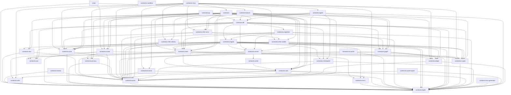

# Contextra Memory Engine — Systemarchitektur & Ring-Modell

Dieses Dokument ist die maßgebliche technische Architekturbeschreibung der Contextra Memory Engine. Es übersetzt die normative Gesamtspezifikation (`docs/spec/CONTEXTRA_FINALE_PRODUKTSPEZIFIKATION.md`) in eine vertiefte Systembeschreibung, dokumentiert den Crate-Bestand (34 Crates), das Ring-0–4-Modell, die Single-Node Ein-Prozess-Garantie (`cargo add contextra`), die Layering-Invarianten und das Inferenz-Modell (Candle als Standard).

---

## Inhaltsverzeichnis
1. [Ring-Modell (Ring 0–4) & Layering-Invarianten](#1-ring-modell)
2. [Crate-Inventar (Ist-Zustand)](#2-crate-inventar)
3. [Abhängigkeitsdiagramm](#3-abhaengigkeitsdiagramm)
4. [Bekannte Abweichungen IST vs. SOLL](#4-bekannte-abweichungen-ist-vs-soll)
5. [Unsafe-Inseln, Invarianten & Locking-Disziplin](#5-unsafe-inseln-invarianten--locking-disziplin)
6. [Referenzen & Weiterführende Dokumente](#6-referenzen)

---

<a id="1-ring-modell"></a>
## 1. Ring-Modell (Ring 0–4) & Layering-Invarianten

Contextra gliedert seine Funktionalität in ein Fünf-Ring-Schichtenmodell (Ring 0 bis Ring 4). Abhängigkeiten dürfen ausschließlich **von höheren Ringen auf tiefere Ringe** verlaufen. Aufwärtskanten (z. B. ein Ring-0-Crate, das von einem Ring-3-Crate abhängt) sind streng verboten.

### 1.1 Definition der Ringe

* **Ring 0 — Foundation & Pure Numerics / Types**:
  Enthält kerneigenen Datenstrukturen, Typdefinitionen, Traits, Kryptographie, Mathematik, Vektor- und Graph-Primitive. Ring 0 enthält **kein `tokio`** (Grundsatz *Sync-Kern, async-Schale*, P26).
* **Ring 1 — Persistence & Cache**:
  Enthält Persistenz-Engines (LSM-Tree, WAL, Block-Cache, KV-Cache-Segmentdateien) und Time-Travel-Registries. Async-I/O ist an den Grenzen erlaubt.
* **Ring 2 — External Adapters & Sandboxing (Leaf Engines)**:
  Isoliert flüchtige oder externe Schwergewicht-Abhängigkeiten (`candle`, `ollama`, `ort`/ONNX, `wasmtime`). Ring 2 Crates sind Blätter im Graphen und hängen nie von Ring 1 oder 3 ab.
* **Ring 3 — Orchestration & Cognition**:
  Enthält die Geschäfts- und Orchestrierungslogik (Transaktions-Management, Collection-Engine, Synthese, PII-Vault/Privacy Gateway, Profil-Routing, Agent-Workflow).
* **Ring 4 — Boundary & Composition Roots**:
  Öffentliche Fassade (`contextra`), MCP-Server (`contextra-mcp`) und Language-Bindings (`contextra-py`). Bildet die einzige Composition Root.

### 1.2 Verbot von Aufwärtskanten (DAG-Integrität, P5)

Das System erzwingt strikte Directed Acyclic Graph (DAG) Modularität.

**Konkretes Negativ-Beispiel für eine verbotene Aufwärtskante:**
In einer früheren Version hing das Datenbank-Crate `contextra-db` (damals Layer 2 / Ring 3) direkt von `contextra-infer-candle` und `contextra-infer-ollama` (damals Layer 3 / Ring 2) ab, um Embedding-Backends direkt zu instanziieren. Dies verletzte P5, da eine Kern-Engine von konkreten Inferenz-Adaptern abhing.
Im Zielmodell (`ARCHITECTURE.md` / `README.md` §4.2) erhält die Engine stattdessen Trait-Objekte (`Arc<dyn EmbeddingProvider>`) aus `contextra-ports` (Ring 0), und die konkrete Verdrahtung erfolgt ausschließlich in Ring 4 (`contextra` Fassade).

### 1.3 Auto-Entity-Extraktion Konfiguration & Abschaltwege

Die automatische OpenIE-Entitätsextraktion beim Einfügen von Dokumenten verfügt über zwei steuerbare Abschaltwege und eine strikte Vorrangordnung:

1. **Compile-Zeit Opt-Out (`auto-extraction-opt-out` Feature):**
   Das Aktivieren des Cargo-Features `auto-extraction-opt-out` deaktiviert die Entitätsextraktion statisch für den gesamten Build, unabhängig von jeglicher Laufzeit-Konfiguration.
2. **Laufzeit-Konfiguration (`AutoExtractionMode` / `CollectionProfile`):**
   Wenn das Compile-Zeit-Feature nicht gesetzt ist, erfolgt die Steuerung dynamisch per Collection über `AutoExtractionMode` (`Enabled` vs. `Disabled`) im `CollectionProfile` bzw. in `AutoExtractionConfig`.

**Vorrangordnung (Precedence):**
`Compile-Zeit Opt-Out (Feature)` **>** `Laufzeit Mode (Disabled)` **>** `Default Mode (Enabled)`

*Falls `auto-extraction-opt-out` aktiv ist, hat eine Laufzeit-Einstellung `AutoExtractionMode::Enabled` keine Wirkung.*

**Deployment-Tier Defaults & Spec D.6 Status:**
- `EdgeMinimal`, `PowerUserLocal` und `EnterpriseShared` nutzen `DEFAULT_AUTO_EXTRACTION_MODE` (`AutoExtractionMode::Enabled`).
- `EnterpriseRegulated` nutzt den benannten Tier-Default `ENTERPRISE_REGULATED_AUTO_EXTRACTION_DEFAULT` (`AutoExtractionMode::Enabled`). Der Status ist im Code und in der Spezifikation als `DECISION-PENDING (Spec D.6)` hinterlegt.

---

<!-- BEGIN GENERATED -->
## 2. Crate-Inventar (Ist-Zustand)

Die folgende Tabelle führt alle 35 im Workspace definierten Crates auf, eingeordnet in das Ring-Modell:

| Crate-Name | Ring | Verantwortlichkeit |
|---|---|---|
| `contextra-adapt` | Ring 0 | Adaptive controllers, bandits, and PID regulators for Contextra |
| `contextra-audit-export` | Ring 0 | GDPR Article 30 Processing Register export generator for Contextra |
| `contextra-avv-generator` | Ring 0 | AVV (Auftragsverarbeitungsvertrag) template generator referencing technical guarantees for Contextra |
| `contextra-core` | Ring 0 | Deprecated Strangler Facade re-exporting Ring-0 types, traits, MVCC, and wire IPC for Contextra |
| `contextra-crypto` | Ring 0 | Encryption at Rest and KV-Cache Security utilities for Contextra |
| `contextra-graph` | Ring 0 | CSR-Graph for entity-relation traversal (Signal 3 in 4-Signal Fusion) |
| `contextra-mvcc` | Ring 0 | Multi-Version Concurrency Control (MVCC), sequence log, and transaction buffer for Contextra |
| `contextra-ports` | Ring 0 | Canonical dyn-compatible port traits for Contextra subsystems |
| `contextra-rank` | Ring 0 | 4-Signal Fusion, Isotonic & Platt Calibration, and Drift Detection for Contextra Cognitive OS |
| `contextra-simd` | Ring 0 | Ring 0 SIMD distance kernels and runtime dispatch for Contextra (Unsafe Island) |
| `contextra-sys` | Ring 0 | Low-level unsafe system abstractions and FFI island for Contextra (Ring 0) |
| `contextra-text` | Ring 0 | Contextra — Text processing and BM25 search for Hybrid Search |
| `contextra-types` | Ring 0 | Canonical domain types, IDs, budgets, filters, and error types for Contextra |
| `contextra-vector` | Ring 0 | HNSW vector index with SIMD distance computation for Contextra |
| `contextra-wire` | Ring 0 | Ring 0 Unsafe Island: Auto-generated FlatBuffers IPC code and zero-copy adapters for Contextra |
| `contextra-checkpoint` | Ring 1 | Backup and snapshot management for Contextra storage |
| `contextra-kvcache` | Ring 1 | Ring 1 Prefix-Radix tree, KV-Block cache, tenant-isolated memory store and tiering for Contextra |
| `contextra-store` | Ring 1 | LSM-Tree storage engine for Contextra |
| `contextra-infer-candle` | Ring 2 | Native Candle GGUF ML inference backend for Contextra |
| `contextra-infer-ollama` | Ring 2 | Keine Beschreibung |
| `contextra-infer-onnx` | Ring 2 | Keine Beschreibung |
| `contextra-sandbox` | Ring 2 | WASM Execution Boundary for Contextra MCP CodeExecution Permission |
| `contextra-agent` | Ring 3 | Persistent agent workflow engine for Contextra — checkpoint/execute/audit loop |
| `contextra-cognition` | Ring 3 | Contextra — Memory consolidation, compaction, and context management |
| `contextra-db` | Ring 3 | Contextra — Embedded hybrid-search for AI agents |
| `contextra-engine` | Ring 3 | Contextra — Core storage, index, and transaction orchestrator engine |
| `contextra-privacy` | Ring 3 | Cloud Egress Security, DLP & Exfiltration Protection for Contextra (Ring 3) |
| `contextra-router` | Ring 3 | Keine Beschreibung |
| `contextra` | Ring 4 | Contextra — Embedded hybrid-search for AI agents (Facade) |
| `contextra-license` | Ring 4 | License and activation enforcement gate layer for Contextra feature rings |
| `contextra-mcp` | Ring 4 | Keine Beschreibung |
| `contextra-py` | Ring 4 | Python bindings for Contextra using PyO3 |
| `contextra-bench` | Tooling | Contextra — Reproducible Benchmark Harness for Retrieval Accuracy |
| `contextra-testkit` | Tooling | Deterministic test utilities, ManualClock, InMemoryStorageEngine, and FaultVfs for Contextra |
| `xtask` | Tooling | Keine Beschreibung |

---

## 3. Abhängigkeitsdiagramm

Das folgende Mermaid-Diagramm bildet die tatsächlichen `[dependencies]` zwischen den Workspace-Crates ab:


```mermaid
graph TD
    contextra[contextra] --> contextra_core[contextra-core]
    contextra[contextra] --> contextra_crypto[contextra-crypto]
    contextra[contextra] --> contextra_db[contextra-db]
    contextra[contextra] --> contextra_infer_candle[contextra-infer-candle]
    contextra[contextra] --> contextra_infer_ollama[contextra-infer-ollama]
    contextra[contextra] --> contextra_infer_onnx[contextra-infer-onnx]
    contextra[contextra] --> contextra_license[contextra-license]
    contextra[contextra] --> contextra_ports[contextra-ports]
    contextra[contextra] --> contextra_privacy[contextra-privacy]
    contextra[contextra] --> contextra_rank[contextra-rank]
    contextra[contextra] --> contextra_router[contextra-router]
    contextra[contextra] --> contextra_store[contextra-store]
    contextra_adapt[contextra-adapt] --> contextra_ports[contextra-ports]
    contextra_adapt[contextra-adapt] --> contextra_types[contextra-types]
    contextra_agent[contextra-agent] --> contextra_checkpoint[contextra-checkpoint]
    contextra_agent[contextra-agent] --> contextra_db[contextra-db]
    contextra_agent[contextra-agent] --> contextra_graph[contextra-graph]
    contextra_agent[contextra-agent] --> contextra_ports[contextra-ports]
    contextra_agent[contextra-agent] --> contextra_router[contextra-router]
    contextra_agent[contextra-agent] --> contextra_store[contextra-store]
    contextra_agent[contextra-agent] --> contextra_types[contextra-types]
    contextra_audit_export[contextra-audit-export] --> contextra_ports[contextra-ports]
    contextra_audit_export[contextra-audit-export] --> contextra_types[contextra-types]
    contextra_avv_generator[contextra-avv-generator] --> contextra_types[contextra-types]
    contextra_bench[contextra-bench] --> contextra_core[contextra-core]
    contextra_bench[contextra-bench] --> contextra_db[contextra-db]
    contextra_bench[contextra-bench] --> contextra_graph[contextra-graph]
    contextra_bench[contextra-bench] --> contextra_infer_onnx[contextra-infer-onnx]
    contextra_bench[contextra-bench] --> contextra_store[contextra-store]
    contextra_bench[contextra-bench] --> contextra_text[contextra-text]
    contextra_bench[contextra-bench] --> contextra_vector[contextra-vector]
    contextra_checkpoint[contextra-checkpoint] --> contextra_core[contextra-core]
    contextra_checkpoint[contextra-checkpoint] --> contextra_ports[contextra-ports]
    contextra_checkpoint[contextra-checkpoint] --> contextra_types[contextra-types]
    contextra_cognition[contextra-cognition] --> contextra_engine[contextra-engine]
    contextra_cognition[contextra-cognition] --> contextra_graph[contextra-graph]
    contextra_cognition[contextra-cognition] --> contextra_ports[contextra-ports]
    contextra_cognition[contextra-cognition] --> contextra_store[contextra-store]
    contextra_cognition[contextra-cognition] --> contextra_types[contextra-types]
    contextra_cognition[contextra-cognition] --> contextra_vector[contextra-vector]
    contextra_core[contextra-core] --> contextra_mvcc[contextra-mvcc]
    contextra_core[contextra-core] --> contextra_ports[contextra-ports]
    contextra_core[contextra-core] --> contextra_types[contextra-types]
    contextra_core[contextra-core] --> contextra_wire[contextra-wire]
    contextra_crypto[contextra-crypto] --> contextra_types[contextra-types]
    contextra_db[contextra-db] --> contextra_adapt[contextra-adapt]
    contextra_db[contextra-db] --> contextra_checkpoint[contextra-checkpoint]
    contextra_db[contextra-db] --> contextra_cognition[contextra-cognition]
    contextra_db[contextra-db] --> contextra_crypto[contextra-crypto]
    contextra_db[contextra-db] --> contextra_engine[contextra-engine]
    contextra_db[contextra-db] --> contextra_graph[contextra-graph]
    contextra_db[contextra-db] --> contextra_ports[contextra-ports]
    contextra_db[contextra-db] --> contextra_rank[contextra-rank]
    contextra_db[contextra-db] --> contextra_store[contextra-store]
    contextra_db[contextra-db] --> contextra_sys[contextra-sys]
    contextra_db[contextra-db] --> contextra_text[contextra-text]
    contextra_db[contextra-db] --> contextra_types[contextra-types]
    contextra_db[contextra-db] --> contextra_vector[contextra-vector]
    contextra_engine[contextra-engine] --> contextra_adapt[contextra-adapt]
    contextra_engine[contextra-engine] --> contextra_checkpoint[contextra-checkpoint]
    contextra_engine[contextra-engine] --> contextra_crypto[contextra-crypto]
    contextra_engine[contextra-engine] --> contextra_graph[contextra-graph]
    contextra_engine[contextra-engine] --> contextra_mvcc[contextra-mvcc]
    contextra_engine[contextra-engine] --> contextra_ports[contextra-ports]
    contextra_engine[contextra-engine] --> contextra_rank[contextra-rank]
    contextra_engine[contextra-engine] --> contextra_store[contextra-store]
    contextra_engine[contextra-engine] --> contextra_sys[contextra-sys]
    contextra_engine[contextra-engine] --> contextra_text[contextra-text]
    contextra_engine[contextra-engine] --> contextra_types[contextra-types]
    contextra_engine[contextra-engine] --> contextra_vector[contextra-vector]
    contextra_graph[contextra-graph] --> contextra_adapt[contextra-adapt]
    contextra_graph[contextra-graph] --> contextra_ports[contextra-ports]
    contextra_graph[contextra-graph] --> contextra_types[contextra-types]
    contextra_infer_candle[contextra-infer-candle] --> contextra_crypto[contextra-crypto]
    contextra_infer_candle[contextra-infer-candle] --> contextra_ports[contextra-ports]
    contextra_infer_candle[contextra-infer-candle] --> contextra_rank[contextra-rank]
    contextra_infer_candle[contextra-infer-candle] --> contextra_types[contextra-types]
    contextra_infer_ollama[contextra-infer-ollama] --> contextra_ports[contextra-ports]
    contextra_infer_ollama[contextra-infer-ollama] --> contextra_rank[contextra-rank]
    contextra_infer_ollama[contextra-infer-ollama] --> contextra_types[contextra-types]
    contextra_infer_onnx[contextra-infer-onnx] --> contextra_infer_candle[contextra-infer-candle]
    contextra_infer_onnx[contextra-infer-onnx] --> contextra_ports[contextra-ports]
    contextra_infer_onnx[contextra-infer-onnx] --> contextra_rank[contextra-rank]
    contextra_infer_onnx[contextra-infer-onnx] --> contextra_types[contextra-types]
    contextra_kvcache[contextra-kvcache] --> contextra_crypto[contextra-crypto]
    contextra_kvcache[contextra-kvcache] --> contextra_ports[contextra-ports]
    contextra_kvcache[contextra-kvcache] --> contextra_types[contextra-types]
    contextra_license[contextra-license] --> contextra_ports[contextra-ports]
    contextra_license[contextra-license] --> contextra_types[contextra-types]
    contextra_mcp[contextra-mcp] --> contextra[contextra]
    contextra_mcp[contextra-mcp] --> contextra_adapt[contextra-adapt]
    contextra_mcp[contextra-mcp] --> contextra_agent[contextra-agent]
    contextra_mcp[contextra-mcp] --> contextra_crypto[contextra-crypto]
    contextra_mcp[contextra-mcp] --> contextra_infer_candle[contextra-infer-candle]
    contextra_mcp[contextra-mcp] --> contextra_infer_ollama[contextra-infer-ollama]
    contextra_mcp[contextra-mcp] --> contextra_infer_onnx[contextra-infer-onnx]
    contextra_mcp[contextra-mcp] --> contextra_license[contextra-license]
    contextra_mcp[contextra-mcp] --> contextra_ports[contextra-ports]
    contextra_mcp[contextra-mcp] --> contextra_privacy[contextra-privacy]
    contextra_mcp[contextra-mcp] --> contextra_rank[contextra-rank]
    contextra_mcp[contextra-mcp] --> contextra_types[contextra-types]
    contextra_mcp[contextra-mcp] --> contextra_wire[contextra-wire]
    contextra_mvcc[contextra-mvcc] --> contextra_types[contextra-types]
    contextra_ports[contextra-ports] --> contextra_types[contextra-types]
    contextra_privacy[contextra-privacy] --> contextra_ports[contextra-ports]
    contextra_privacy[contextra-privacy] --> contextra_types[contextra-types]
    contextra_py[contextra-py] --> contextra_adapt[contextra-adapt]
    contextra_py[contextra-py] --> contextra_core[contextra-core]
    contextra_py[contextra-py] --> contextra_db[contextra-db]
    contextra_py[contextra-py] --> contextra_rank[contextra-rank]
    contextra_py[contextra-py] --> contextra_router[contextra-router]
    contextra_py[contextra-py] --> contextra_store[contextra-store]
    contextra_rank[contextra-rank] --> contextra_ports[contextra-ports]
    contextra_rank[contextra-rank] --> contextra_types[contextra-types]
    contextra_router[contextra-router] --> contextra_adapt[contextra-adapt]
    contextra_router[contextra-router] --> contextra_ports[contextra-ports]
    contextra_router[contextra-router] --> contextra_privacy[contextra-privacy]
    contextra_router[contextra-router] --> contextra_types[contextra-types]
    contextra_router[contextra-router] --> contextra_wire[contextra-wire]
    contextra_sandbox[contextra-sandbox]
    contextra_simd[contextra-simd] --> contextra_core[contextra-core]
    contextra_store[contextra-store] --> contextra_core[contextra-core]
    contextra_store[contextra-store] --> contextra_crypto[contextra-crypto]
    contextra_store[contextra-store] --> contextra_mvcc[contextra-mvcc]
    contextra_store[contextra-store] --> contextra_ports[contextra-ports]
    contextra_store[contextra-store] --> contextra_sys[contextra-sys]
    contextra_sys[contextra-sys]
    contextra_testkit[contextra-testkit] --> contextra_ports[contextra-ports]
    contextra_testkit[contextra-testkit] --> contextra_types[contextra-types]
    contextra_text[contextra-text] --> contextra_ports[contextra-ports]
    contextra_text[contextra-text] --> contextra_types[contextra-types]
    contextra_types[contextra-types]
    contextra_vector[contextra-vector] --> contextra_core[contextra-core]
    contextra_vector[contextra-vector] --> contextra_crypto[contextra-crypto]
    contextra_vector[contextra-vector] --> contextra_simd[contextra-simd]
    contextra_vector[contextra-vector] --> contextra_sys[contextra-sys]
    contextra_wire[contextra-wire]
    xtask[xtask] --> contextra_bench[contextra-bench]
    xtask[xtask] --> contextra_router[contextra-router]
    xtask[xtask] --> contextra_types[contextra-types]
```
<!-- END GENERATED -->

---

<a id="4-bekannte-abweichungen-ist-vs-soll"></a>
## 4. Bekannte Abweichungen IST vs. SOLL

Während der schrittweisen Strangler-Migration (§20) existieren vorübergehende Diskrepanzen zwischen dem Zielmodell laut `README.md` und dem vorgefundenen Repository-Stand:

1. **`contextra-core` als Fassaden-Re-Export:**
   * *SOLL:* `contextra-core` entfällt als monolithisches Crate vollständig.
   * *IST:* `contextra-core` existiert im Repo als Re-Export-Fassade über `contextra-types`, `contextra-ports`, `contextra-mvcc` und `contextra-wire`, um Abwärtskompatibilität während der Migration zu sichern.
2. **`contextra-db` Re-Export & Aufwärtskante in `contextra-router`:**
   * *SOLL:* `contextra-db` wird in `engine`/`cognition`/`rank`/`adapt`/`router`/`privacy` zerlegt. `contextra-router` darf nicht von `contextra-db` abhängen.
   * *IST:* `contextra-db` existiert weiterhin als Fassade. `contextra-router` importiert noch `contextra-db` (dokumentiertes Audit: `docs/refactor/router-db-edge-audit.md`).
3. **Inferenz-Namenskonvention:**
   * *SOLL:* Die Inferenz-Crates tragen vereinheitlichte Namen `contextra-infer-candle`, `contextra-infer-ollama` und `contextra-infer-onnx`.
   * *IST:* Vollständig umbenannt und im Workspace unter diesen Namen registriert (vormals `contextra-candle`, `contextra-ollama`, `contextra-embed` <!-- crate-ref-ignore -->).
4. **Vektorindex-Namenskonvention:**
   * *SOLL:* Das Vektorindex-Crate heißt `contextra-vector`.
   * *IST:* Vollständig umbenannt und im Workspace als `contextra-vector` registriert (vormals `contextra-index` <!-- crate-ref-ignore -->).
5. **Legacy-Calibration-Crate:**
   * *SOLL:* `contextra-rank` geht in `contextra-adapt` und `contextra-rank` auf.
   * *IST:* `contextra-rank` existiert aktuell noch als eigenständiges Crate.

---

<a id="5-unsafe-inseln-invarianten--locking-disziplin"></a>
## 5. Unsafe-Inseln, Invarianten & Locking-Disziplin

### 5.1 Zero-Panic-Doctrine & Unsafe-Inseln

Standardmäßig gilt in allen Nicht-Insel-Crates `#![forbid(unsafe_code)]`. Es gibt genau **drei zulässige Unsafe-Inseln** im Produktionscode, die per `#![allow(unsafe_code)]` ausgenommen sind:

1. **`contextra-sys`**: Abstraktionen für Low-Level-OS-Operationen (`mmap`, `mlock`, Win32-ACLs).
2. **`contextra-simd`**: SIMD-Vektordistanzberechnungskerne (AVX2, AVX-512, NEON) mit Laufzeit-Dispatch.
3. **`contextra-wire`**: FlatBuffers-generierter Code, der konstruktionsbedingt `unsafe` Blöcke für Zero-Copy-Transfers benötigt.

Jeder `unsafe`-Block in diesen Inseln muss zwingend mit einem `// SAFETY:`-Kommentar begründet werden.

### 5.2 Locking-Disziplin & Sperrenhierarchie

Zur Vermeidung von Deadlocks gilt im gesamten System eine strikte Sperrenhierarchie:

```
collections (RwLock) → kv_locks (schlüssel-granular via KvKeyLocks) → embedder (RwLock)
```

* **Sperren-Reihenfolge**: Wenn mehrere Locks akquiriert werden müssen, geschieht dies ausnahmslos von links nach rechts.
* **Key-Granulares Locking (`KvKeyLocks`)**: Schreibzugriffe auf Schlüsselebene nutzen Sharded Locks (`RwLock<()>`). Bei Mehrschlüssel-Operationen (`acquire_multi_sorted`) werden die Shard-Indizes zwingend **aufsteigend sortiert** akquiriert, um Zyklen im Wait-For-Graph auszuschließen.
* **Kein Async unter Sync-Locks**: Kein `.await`-Aufruf darf gehalten werden, während ein synchroner Mutex/RwLock-Guard existiert.

---

<a id="6-referenzen"></a>
## 6. Referenzen & Weiterführende Dokumente

* **Normative Spezifikation**: `README.md`
* **Entwickler- & Agent-Anweisungen**: `AGENTS.md`
* **Refactoring- & Audit-Protokolle**:
  * `docs/refactor/router-db-edge-audit.md` (Audit der `router` → `db` Abhängigkeit)
  * `docs/refactor/mcp-upward-edges-audit.md` (Audit der MCP-Gateway-Schichten)
