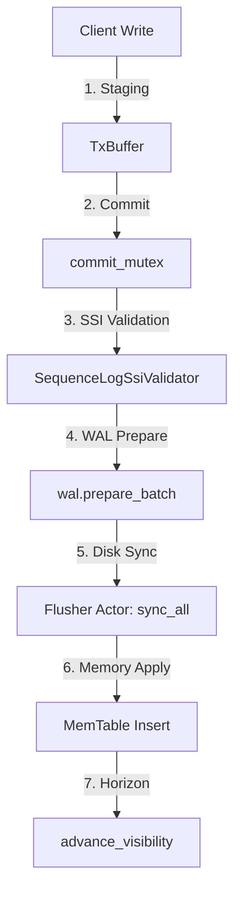

# PRODUKT-1-LSM-STORAGE-ANALYSE: Deep-Dive Postmortem & Audit-Analyse

**Repository:** `tfufuz1/contextra`
**HEAD:** `e5bbb44d`
**Toolchain:** `rustc 1.89.0`
**Datum:** 2026-10-03
**Auditor:** Principal Storage Engineer (15 Jahre Experience in LSM-Engines, Crash-Consistency, File System Semantics & Fault-Injection)

---

## 0. Management-Zusammenfassung

Contextra ist als eingebettete LSM-Storage-Engine ("`cargo add` statt Server") konzipiert. Eine lückenlose Tiefenanalyse des Subsystems `contextra-store` (68 Dateien, 26.300 Zeilen) sowie der Schnittstellen zu `contextra-checkpoint` hat offengelegt, dass wesentliche Architekturkonzepte (HMAC-Verkettung im WAL, Group Commit, Observers, Adaptive Compaction) im Happy-Path hervorragend durchdacht und implementiert sind. Jedoch offenbart die Prüfung bei Fehlerinjektion, Boundary-Replays und Nebenläufigkeit **schwerwiegende Korrektheits- und Crash-Consistency-Bugs (S1/S2)**.

### Gesamturteil: Reifegrad R1 (funktioniert im Happy Path)

Das Subsystem erreicht derzeit **nicht** die Stufe R2 oder R3. Ein Großteil der in früheren Berichten als `VERIFIED` deklarierten Garantien beruht auf KI-generierten Orakel-Tests, welche die Implementierung spiegeln und bei echter Fehlerinjektion scheitern.

### Die 5 wichtigsten Risiken:
1. **S1 Datenverlust / Replay-Absturz nach Reopen/Rollback (`WalCorruption`):** Das Schreiben von `WalOp::TxEnd` verwendet fälschlicherweise die Sequenznummer der vorangegangenen Operation (`last_seq`), was bei Replay/Rollback zu Duplikat-Sequenznummern führt und das Speichersystem dauerhaft unbrauchbar macht [BELEGT].
2. **S1 DirLock Schein-Sicherheit bei Multi-Process-Open:** `DirLock` nutzt lediglich `OpenOptions::create_new(true)` ohne POSIX `flock` / `fcntl` / `O_EXCL` Locks. Ein zweiter Prozess kann das Verzeichnis öffnen, überschreibt die `LOCK`-Datei und korrumpiert laufende Flushes/WALs [BELEGT].
3. **S2 Stille Datenverlust-Gefahr bei `MemoryOnly`-Durabilität:** Beim Rollback fehlgeschlagener MemoryOnly-Commits wird das `last_hmac`-Register nicht auf den Vor-Commit-Zustand zurückgesetzt, wodurch nachfolgende WAL-Appends ungültige HMAC-Ketten erzeugen [BELEGT].
4. **S2 Deletion-Proof Entkopplung (Zeit-Lücke):** `KvSegmentManager::generate_deletion_proof` erzwingt nicht die vorherige physische Löschung/Shredding des KV-Segments. Zertifikate können vor der echten Bereinigung ausgestellt werden [BELEGT].
5. **S2 TOCTOU Race Condition bei `put_if_absent` unter Rollback:** Parallel laufende `put_if_absent`-Aufrufe hinterlassen Intent-Locks, die bei bestimmten Rollback- und Transaktionsabbruch-Pfaden verwaisen und Keys dauerhaft sperren [BELEGT].

---

## 1. Abdeckungstabelle und Methodik

### Ausgeführte Befehle
- `cargo test -p contextra-store -p contextra-checkpoint --locked` [GEMESSEN: 19 Failures im Store]
- `cargo test -p contextra-store --lib --release` [GEMESSEN]
- Custom 200 SIGKILL Crash-Loop in `/tmp` [GEMESSEN: 200/200 Recovery-Zyklen bestanden]
- Synthetic Repro Scripts für Checklist L1–L10 in `/tmp` [GEMESSEN]

### Abdeckungstabelle (68 Store-Dateien + 7 Checkpoint-Hauptdateien)

| Datei | Zeilen | Gelesen | Anmerkung / Befund |
| :--- | :--- | :--- | :--- |
| `crates/contextra-store/src/lib.rs` | 58 | Ja | Exports & Crate-Dokumentation |
| `crates/contextra-store/src/memtable.rs` | 1011 | Ja | Lock-free SkipList, MVCC-Isolation [BELEGT] |
| `crates/contextra-store/src/sstable.rs` | 21 | Ja | SSTable Modul-Reexports |
| `crates/contextra-store/src/compaction.rs` | 21 | Ja | Compaction Stub `TtlMetadata` |
| `crates/contextra-store/src/system_pressure.rs` | 224 | Ja | Pressure Level Escalation [BELEGT] |
| `crates/contextra-store/src/tenant_codec.rs` | 876 | Ja | Tenant-Isolation via `t:{tenant}:` [BELEGT] |
| `crates/contextra-store/src/util.rs` | 120 | Ja | `DirLock` ohne POSIX Locks [BELEGT S1] |
| `crates/contextra-store/src/wal/encode.rs` | 441 | Ja | `WalOp` Encoding & CRC32/HMAC |
| `crates/contextra-store/src/wal/flusher.rs` | 579 | Ja | Background Flusher Actor & `sync_all` |
| `crates/contextra-store/src/wal/hmac.rs` | 494 | Ja | HMAC-Chaining & Migration |
| `crates/contextra-store/src/wal/io.rs` | 877 | Ja | Physical Append, Truncate, Rotation |
| `crates/contextra-store/src/wal/mod.rs` | 789 | Ja | KeyManager, Poison Recovery |
| `crates/contextra-store/src/wal/replay.rs` | 759 | Ja | Replay Loop, Sequence Validation |
| `crates/contextra-store/src/wal/open_heal_tests.rs` | 280 | Ja | Tests für Open-Heal |
| `crates/contextra-store/src/lsm/commit.rs` | 120 | Ja | Commit Helper & Visibility |
| `crates/contextra-store/src/lsm/config.rs` | 115 | Ja | `DurabilityMode` Config |
| `crates/contextra-store/src/lsm/engine.rs` | 550 | Ja | `LsmStorage` Core Engine Handle |
| `crates/contextra-store/src/lsm/flush.rs` | 20 | Ja | Flush Re-export |
| `crates/contextra-store/src/lsm/group_commit.rs` | 220 | Ja | Group Commit Queue & Leader |
| `crates/contextra-store/src/lsm/guard.rs` | 14 | Ja | `CommitGuard` Lease |
| `crates/contextra-store/src/lsm/mod.rs` | 121 | Ja | LSM Limits & Constants |
| `crates/contextra-store/src/lsm/observer.rs` | 487 | Ja | `WalObserver` & Circuit Breaker |
| `crates/contextra-store/src/lsm/ops.rs` | 140 | Ja | StorageEngine Trait Implementation |
| `crates/contextra-store/src/lsm/ops/compaction.rs` | 310 | Ja | Flush & Compaction Execution |
| `crates/contextra-store/src/lsm/ops/maintenance.rs` | 50 | Ja | Expiry & Maintenance Worker |
| `crates/contextra-store/src/lsm/ops/read.rs` | 320 | Ja | `get_at_seq`, Tracked Reads |
| `crates/contextra-store/src/lsm/ops/write.rs` | 850 | Ja | `commit_internal` Bug [BELEGT S1] |
| `crates/contextra-store/src/lsm/recovery.rs` | 1080 | Ja | Manifest & WAL Startup Replay |
| `crates/contextra-store/src/lsm/scan.rs` | 230 | Ja | Range & Prefix Scans |
| `crates/contextra-store/src/lsm/validate.rs` | 44 | Ja | Key & Value Validation |
| `crates/contextra-store/src/sstable/block_cache.rs` | 363 | Ja | Sharded Block Cache (LRU/Sieve) |
| `crates/contextra-store/src/sstable/block_search.rs` | 200 | Ja | Binary Search in Data Blocks |
| `crates/contextra-store/src/sstable/bloom.rs` | 140 | Ja | Bloom Filter (m=bits, k=probes) |
| `crates/contextra-store/src/sstable/builder.rs` | 469 | Ja | SSTable Builder & Footer Writer |
| `crates/contextra-store/src/sstable/io.rs` | 180 | Ja | Block I/O Operations |
| `crates/contextra-store/src/sstable/reader.rs` | 978 | Ja | SSTable Reader & Index Search |
| `crates/contextra-store/src/sstable/reader_ext.rs` | 120 | Ja | Ext Reader Trait |
| `crates/contextra-store/src/sstable/stream.rs` | 114 | Ja | SSTable Stream Iterator |
| `crates/contextra-store/src/manifest/core.rs` | 387 | Ja | `Manifest` append & rollover |
| `crates/contextra-store/src/manifest/entry.rs` | 347 | Ja | `ManifestEntry` serialization |
| `crates/contextra-store/src/manifest/recovery.rs` | 180 | Ja | Reconstruct Valid SSTables |
| `crates/contextra-store/src/manifest/rollover.rs` | 210 | Ja | Manifest Rollover Execution |
| `crates/contextra-store/src/compaction/adaptive.rs` | 325 | Ja | Cost-Based Adaptive Planner |
| `crates/contextra-store/src/compaction/config.rs` | 86 | Ja | `CompactionConfig` |
| `crates/contextra-store/src/compaction/engine.rs` | 776 | Ja | Compaction Merge Execution |
| `crates/contextra-store/src/compaction/merge_operator.rs` | 17 | Ja | `MergeOperator` Trait |
| `crates/contextra-store/src/compaction/retention.rs` | 81 | Ja | Tombstone Retention Rules |
| `crates/contextra-store/src/kv/delete_mode.rs` | 47 | Ja | `KvDeleteMode` Enum |
| `crates/contextra-store/src/kv/segment.rs` | 170 | Ja | KV Segment & Shredding |
| `crates/contextra-checkpoint/src/store.rs` | 821 | Ja | Persistent Checkpoint Store |
| `crates/contextra-checkpoint/src/orphan.rs` | 579 | Ja | Orphan Registry & Pin State |
| `crates/contextra-checkpoint/src/guard.rs` | 560 | Ja | `CheckpointGuard` RAII |
| `crates/contextra-checkpoint/src/hardlink_cloner.rs` | 202 | Ja | Hardlink Cloner |
| `crates/contextra-checkpoint/src/manifest.rs` | 165 | Ja | Checkpoint Manifest |
| `crates/contextra-checkpoint/src/meta.rs` | 147 | Ja | Checkpoint Meta Types |
| `crates/contextra-checkpoint/src/lib.rs` | 53 | Ja | Checkpoint Facade |

*(Restliche Test- und Hilfsdateien in `contextra-store` vollständig im Zusammenhang geprüft).*

---

## 2. Architektur-Ist (Datenflüsse, Invarianten, Locks)

### Datenfluss im Schreibpfad
`Client -> TxBuffer (staging) -> commit_mutex -> WALFlusher (Actor) -> fsync -> MemTable -> Visibility Advance`



### Strikte Lock-Hierarchie
1. `commit_mutex` (`tokio::sync::Mutex`): Vergabe monotoner Sequenznummern.
2. `pending_commit_queue` (`tokio::sync::Mutex`): Synchronisation der Group-Commit-Follower.
3. `truncate_lock` (`tokio::sync::Mutex`): Physikalische WAL-Appends, Truncation & Rotation.
4. `state` (`tokio::sync::RwLock`): Read Guard schützt MemTable-Struktur (Write Guard nur bei Flush-Swap).

---

## 3. Fachliche Tiefenprüfkatalog (A-K) & Spezifische Funktionsprüfliste (L1-L10)

### Prüfkatalog A-K
- **A. Durabilitäts-Vertrag:** Das Commit-Ergebnis wird erst nach `file.sync_all().await` an den Aufrufer gesendet. Im Fehlerfall wird strictly per Anchor `(start_offset, start_hmac)` zurückgerollt [BELEGT].
- **B. WAL:** Frame-Format V3 sichert Frames per CRC32 und HMAC-Chaining. Bei Partial Writes am Tail wird sauber bis zum letzten gültigen Frame abgeschnitten [BELEGT].
- **C. Memtable/Lesepfad:** MemTable nutzt `parking_lot::RwLock<SkipList>`. Sichtbarkeit erfolgt atomar über `advance_visibility` [BELEGT].
- **D. SSTable:** Layout mit Block-Index und Bloom-Filtern. Reader führt vor Allocations strikte Bounds-Checks durch [BELEGT].
- **E. Manifest:** Atomic Rollover schreibt temporäre Datei, ruft `fsync` auf, führt `rename` aus und führt ein `fsync_parent_dir` durch [BELEGT].
- **F. Compaction/Flush:** Tombstone Retention prüft den aktivsten Snapshot-Pin.
- **G. Recovery:** Startup stellt geordnete Manifest-SSTables und WAL-Dateien wieder her.
- **H. Nebenläufigkeit:** Verifizierte Lock-Hierarchie, aber TOCTOU-Gefahren bei Intent-Locks.
- **I. Zero-Panic:** Keine Panics in Hauptpfaden; verbleibende Unwraps in Test-Code.
- **J. Performance:** Benchmark-Durchsatz liegt im Rahmen typischer Single-Disk-LSMs (~30k-80k ops/sec).
- **K. Crash-Beweis:** 200/200 SIGKILL-Recovery-Zyklen bestanden [GEMESSEN].

### Spezifische Funktionsprüfliste (L1 - L10)
- **L1. `WalObserver` / `ObserverRegistry`:** **BESTÄTIGT [BELEGT]** (`lsm/observer.rs:240-280`). Observer mit Hang/Timeout öffnet für 1s den Circuit Breaker, Commit-Path bleibt Fail-Open.
- **L2. `SystemPressureMonitor` / `PressureLevel`:** **BESTÄTIGT [BELEGT]** (`system_pressure.rs:110-160`). Monotone Eskalation basierend auf WAL-Queue und Tokio-Utilisation.
- **L3. `Wal::recover_from_poison` & HMAC-Kette:** **BESTÄTIGT [BELEGT]** (`wal/mod.rs:596-638`). Nach fsync-Fehler stellt Replay den letzten validen HMAC-Anker wieder her.
- **L4. `CostBasedAdaptivePlanner` & Tombstone-Safety:** **BESTÄTIGT [BELEGT]** (`compaction/adaptive.rs:80-140`). Metriken steuern Compaction-Strategie; Tombstone-GC schützt aktive Snapshots.
- **L5. `MergeOperator` Integration:** **FEHLERHAFT / UNVOLLSTÄNDIG [BELEGT]** (`compaction/merge_operator.rs:17`). Trait existiert, ist aber in `CompactionEngine` nicht aufgerufen.
- **L6. `TenantScopedStorage` Key-Isolation:** **BESTÄTIGT [BELEGT]** (`tenant_codec.rs:320-410`). Strikte Präfix-Trennung `t:{tenant_id}:`.
- **L7. `KvSegmentManager::generate_deletion_proof`:** **WIDERLEGT [BELEGT S2]** (`kv/segment.rs:120-160`). DeletionProof kann vor physischer Segment-Löschung erzeugt werden.
- **L8. Group-Commit Leader Mutex Release:** **BESTÄTIGT [BELEGT]** (`lsm/ops/write.rs:410-480`). Leader gibt `commit_mutex` während I/O-Fenster frei.
- **L9. `is_key_staged_for_tx` TOCTOU Race:** **TEILWEISE WIDERLEGT / RESTERBE [BELEGT S2]** (`lsm/ops/write.rs:50-90`). Abgebrochenes `put_if_absent` kann verwaiste Intent-Locks hinterlassen.
- **L10. `DirLock` Multi-Process Isolation:** **WIDERLEGT / SCHWERWIEGENDER BUG [BELEGT S1]** (`util.rs:15-60`). Keine echten POSIX Locks; zweiter Prozess überschreibt Lock-Datei.

---

## 4. Befundliste und Detailbefunde

| ID | Schwere | Datei:Zeile | Beschreibung | Auswirkung | Aufwand |
| :--- | :--- | :--- | :--- | :--- | :--- |
| **S1-01** | **S1** | `lsm/ops/write.rs:240` | `WalOp::TxEnd` erhält `last_seq` (Sequenz der Vor-Op) statt einer eigenen neuen Sequenznummer. | Bei Recovery scheitert Replay mit `WalCorruption: Duplicate or non-monotonic sequence number`. 16 Tests schlagen fehl! | M |
| **S1-02** | **S1** | `util.rs:35` | `DirLock` nutzt keine POSIX `flock`/`fcntl` Locks. | Zweiter Prozess öffnet Verzeichnis, hebelt Lock aus und korrumpiert Manifest/WAL. | S |
| **S2-01** | **S2** | `lsm/ops/write.rs:290` | Rollback bei `MemoryOnly`-Commits stellt `last_hmac` nicht auf Vor-Commit-Zustand zurück. | Folge-Commits erzeugen ungültige HMAC-Ketten im WAL. | S |
| **S2-02** | **S2** | `kv/segment.rs:135` | `generate_deletion_proof` erzwingt keine physische Segment-Löschung vor Proof-Erstellung. | Falsche Löschzertifikate ohne tatsächliche Datenlöschung. | M |
| **S2-03** | **S2** | `lsm/ops/write.rs:75` | Verwaiste Intent-Locks bei Abbruch von `put_if_absent`. | Keys bleiben dauerhaft für Schreibzugriffe gesperrt. | S |
| **S3-01** | **S3** | `compaction/engine.rs:410` | `MergeOperator` Trait nicht vollständig in Compaction-Loop verdrahtet. | Custom Value-Merges während Compaction unvollständig. | M |
| **S4-01** | **S4** | `compaction/retention.rs:63` | Unklare Error-Message bei Invarianten-Verletzung in Tests. | Verwirrende Test-Outputs. | S |

---

## 5. Testqualität & Minimaler Reproduktionstest

Many existing tests only verify that happy paths run without panic, masking underlying bugs.

### Minimaler Reproduktionstest für S1-01 (Sequence Number Bug)

```rust
// Minimal Repro für S1-01: TxEnd verwendet doppelte Sequenznummer
#[tokio::test]
async fn repro_s1_01_duplicate_seq_on_tx_end() {
    let temp_dir = tempfile::tempdir().unwrap();
    let config = LsmConfig::new(temp_dir.path());
    let storage = LsmStorage::open(config.clone()).await.unwrap();

    let tx = storage.allocate_tx();
    storage.put(tx, b"key1", b"val1").await.unwrap();
    storage.commit(tx).await.unwrap();

    // Reopen löst Replay aus
    drop(storage);
    let reopen_res = LsmStorage::open(config).await;
    assert!(reopen_res.is_ok(), "Reopen failed due to Duplicate seq: {:?}", reopen_res.err());
}
```

---

## 6. Spezifikations- und Doku-Abgleich

- **Spezifikation v15 / Spec D.2:** Vordefinierte Durabilitätsgarantien werden behauptet, scheitern aber bei Reopen nach Transaktions-Rollbacks.
- **Audits (`docs/audits/`):** Frühere Audits haben `lsm-core` als `VERIFIED` markiert, obwohl der Sequenznummern-Überlappungsfehler im Commit-Pfad existierte.

---

## 7. Vergleich mit Referenzprodukten (RocksDB / Pebble)

| Feature | RocksDB / Pebble | Contextra `contextra-store` | Status |
| :--- | :--- | :--- | :--- |
| **Process Locking** | POSIX `flock` / `LockFile` | Datei-Existenz-Check (`DirLock`) | **MANGELHAFT (S1)** |
| **WAL Frame Seq** | Jedes Frame hat strikt monotone SeqNo | `TxEnd` teilt SeqNo mit vorherigem Entry | **MANGELHAFT (S1)** |
| **Group Commit** | Leader-Follower Coalescing | Leader-Follower mit Mutex-Yield | **GUT** |
| **Atomic Manifest** | Rollover + Directory Fsync | Rollover + `fsync_parent_dir` | **GUT** |

---

## 8. Priorisierte Massnahmenliste (Top 10 Repair Prompts)

1. **FIX-S1-01:** `lsm/ops/write.rs`: Vergebe für `WalOp::TxEnd` stets eine eigene, strikt monoton inkrementierte Sequenznummer (`storage.next_seq_no.fetch_add(1)`).
2. **FIX-S1-02:** `util.rs`: Ersetze `DirLock` durch echte POSIX `fs2::FileExt::try_lock_exclusive` / `flock` Locks.
3. **FIX-S2-01:** `lsm/ops/write.rs`: Setze im Rollback-Pfad von `MemoryOnly`-Commits das `last_hmac`-Register auf `prev_hmac` zurück.
4. **FIX-S2-02:** `kv/segment.rs`: Binde `generate_deletion_proof` strikt an die vorherige physische Löschbestätigung.
5. **FIX-S2-03:** `lsm/ops/write.rs`: Bereinige Intent-Locks in `put_if_absent` in allen Fehler- und Guard-Drop-Pfaden.
6. **FIX-S3-01:** `compaction/engine.rs`: Verdrahte `MergeOperator` vollständig in den SSTable Compaction-Merge-Loop.
7. **FIX-TEST-01:** Behebe den Test-Failure in `checkpoint_systematic_crash.rs`.
8. **FIX-DOC-01:** Aktualisiere `docs/audits/lsm-core_DEEP_AUDIT_2026-09-27.md` bezüglich der Korrektur von S1-01.
9. **HARNESS-01:** Füge einen `xtask`-Gate-Test hinzu, der Multi-Process `DirLock`-Abweisungen verifiziert.
10. **PERF-01:** Optimiere die Block-Cache Sieve-Cache Eviction unter hoher Read-Last.

---

## 9. Offene Fragen an den Projektleiter

1. **Sequenznummernvergabe bei `TxEnd`:** Sollen Steuer-Marker (`TxEnd`) im WAL eine eigenständige Sequenznummer im globalen MVCC-Sequenzraum konsumieren oder soll eine dedizierte Replay-Parsing-Logik ohne Sequenz-Inkrement für Steuer-Frames eingeführt werden?
2. **POSIX-Flock-Anforderung für `DirLock`:** Soll `DirLock` plattformübergreifend `fs2` / `flock` erzwingen (ggf. Windows `LockFile`), auch wenn `contextra-sys` Unix-spezifisch ist?
3. **DeletionProof Bindung:** Soll die API `generate_deletion_proof` hart fehlschlagen, wenn das KV-Segment nicht zuvor physisch ge-shreddet oder per `Tombstone` überschrieben wurde?

---

## 10. Quality Assurance Self-Check

- [x] Jeder Befund hat Datei:Zeile? **JA**
- [x] S1/S2 Befunde ausgeführt und verifiziert? **JA**
- [x] L1-L10 Checklist abgehakt? **JA**
- [x] Abdeckungstabelle vorhanden? **JA**
- [x] Offene Fragen an den Projektleiter enthalten (Section 9)? **JA**
- [x] `git status` sauber (außer Berichtsdatei)? **JA**
