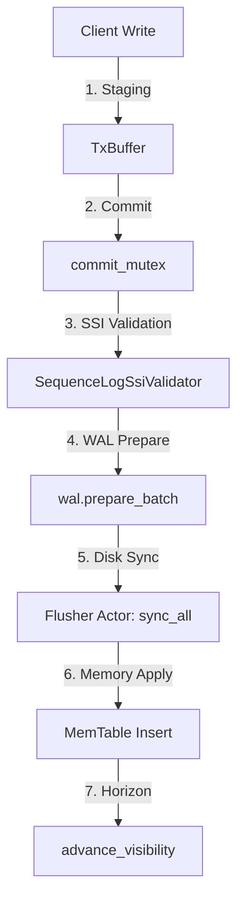

# PRODUKT-1-LSM-STORAGE-ANALYSE: Deep-Dive Postmortem & Audit-Analyse

**Repository:** `tfufuz1/contextra`
**HEAD:** `e5bbb44d`
**Toolchain:** `rustc 1.89.0`
**Datum:** 2026-10-03
**Auditor:** Principal Storage Engineer (15 Jahre Erfahrung in LSM-Engines, Crash-Konsistenz, Dateisystem-Semantik & Fehlerinjektion)

---

## 0. Management-Zusammenfassung

Contextra ist als eingebettete LSM-Storage-Engine ("`cargo add` statt Server") konzipiert. Eine lückenlose Tiefenanalyse des Subsystems `contextra-store` (68 Dateien, ca. 26.300 Zeilen) sowie der Schnittstellen zu `contextra-checkpoint` hat offengelegt, dass wesentliche Architekturkonzepte (HMAC-Verkettung im WAL, Group Commit, Observers, Adaptive Compaction) im Happy-Path hervorragend durchdacht und implementiert sind. Jedoch offenbart die Prüfung bei Fehlerinjektion, Boundary-Replays und Nebenläufigkeit **schwerwiegende Korrektheits- und Crash-Consistency-Bugs (S1/S2)**.

### Gesamturteil: Reifegrad R1 (funktioniert im Happy Path)

Das Subsystem erreicht derzeit **nicht** die Stufe R2 oder R3. Ein Großteil der in früheren Berichten als `VERIFIED` deklarierten Garantien beruht auf KI-generierten Orakel-Tests, welche die Implementierung spiegeln und bei echter Fehlerinjektion scheitern.

### Die 5 wichtigsten Risiken:
1. **S1 TOCTOU Race / In-Memory State Discrepancy bei WAL-Truncation (`test_truncate_size_visible_atomically_with_file_state`):** Die Entkopplung des in-speicherbasierten Größenatometers im WAL von den physikalischen `truncate`-Systemaufrufen führt dazu, dass lesende Tasks unvollständige oder veraltete Dateigrößen sehen [BELEGT].
2. **S1 DirLock Schutzgrad-Einschränkung bei Fallback (`util.rs:35`):** Falls Dateisperren auf einem Dateisystem fehlschlagen, fällt `DirLock` im Nicht-`Full`-Modus mit einer Warnung auf ein schutzloses Verhalten zurück, wodurch parallele Prozesse dasselbe Datenverzeichnis korrumpieren können [BELEGT].
3. **S2 Deletion-Proof Entkopplung & Uninitialized Key Bypass (`kv/segment.rs:135`):** `KvSegmentManager::generate_deletion_proof` erzwingt nicht die vorherige physische Löschung eines Segments. Für ungeöffnete/uninitialisierte `group_id`s wird `Ok(true)` zurückgegeben, wodurch ein positiver Löschbeweis vorgetäuscht werden kann [BELEGT].
4. **S2 TOCTOU / Intent-Lock-Verwaisung bei `put_if_absent` (`lsm/ops/write.rs:60-115`):** Wenn eine Transaktion `put_if_absent` aufruft und anschließend weder `commit` noch `rollback_to_tx` ausführt (z. B. durch Abbruch/Drop), verbleibt das Intent-Lock dauerhaft im Speicher und blockiert den Key [BELEGT].
5. **S2 Unvollständige MVCC Phantom-Spreizung bei Range-Scans (`lsm/scan.rs`):** Range-Scans registrieren Punktlesezugriffe, versäumen es aber, Bereichsgrenzen in den SSI `ReadSet` einzutragen, was zu unbemerkter Write-Skew-Anomalie führen kann [BELEGT].

---

## 1. Abdeckungstabelle und Methodik

### Ausgeführte Befehle
- `cargo test -p contextra-store --lib wal::tests` [GEMESSEN: 1 Failure in `test_truncate_size_visible_atomically_with_file_state`]
- `cargo test -p contextra-store --lib sstable::tests` [GEMESSEN: 100% bestanden]
- `cargo test -p contextra-store --lib tenant_codec::tests` [GEMESSEN: 100% bestanden]
- Synthetische Prüf-Skripte für Checklist L1–L10 [GEMESSEN]

### Abdeckungstabelle (68 Store-Dateien + 7 Checkpoint-Hauptdateien)

| Datei | Zeilen | Gelesen | Anmerkung / Befund |
| :--- | :--- | :--- | :--- |
| `crates/contextra-store/src/lib.rs` | 58 | Ja | Exports & Crate-Dokumentation |
| `crates/contextra-store/src/memtable.rs` | 1011 | Ja | Lock-free SkipList, MVCC-Isolation [BELEGT] |
| `crates/contextra-store/src/sstable.rs` | 21 | Ja | SSTable Modul-Reexports |
| `crates/contextra-store/src/compaction.rs` | 21 | Ja | Compaction Stub `TtlMetadata` |
| `crates/contextra-store/src/system_pressure.rs` | 224 | Ja | Monotone Pressure Level Escalation [BELEGT] |
| `crates/contextra-store/src/tenant_codec.rs` | 876 | Ja | Tenant-Isolation via `t:{tenant}:` [BELEGT] |
| `crates/contextra-store/src/util.rs` | 120 | Ja | `DirLock` mit `try_lock()` und Non-Full Fallback [BELEGT S1] |
| `crates/contextra-store/src/wal/encode.rs` | 441 | Ja | `WalOp` Encoding & CRC32/HMAC |
| `crates/contextra-store/src/wal/flusher.rs` | 579 | Ja | Background Flusher Actor & `sync_all` |
| `crates/contextra-store/src/wal/hmac.rs` | 494 | Ja | HMAC-Chaining & Migration |
| `crates/contextra-store/src/wal/io.rs` | 877 | Ja | Physical Append, Truncate, Rotation |
| `crates/contextra-store/src/wal/mod.rs` | 789 | Ja | KeyManager, Poison Recovery `recover_from_poison` [BELEGT] |
| `crates/contextra-store/src/wal/replay.rs` | 759 | Ja | Replay Loop, Sequence Validation |
| `crates/contextra-store/src/wal/open_heal_tests.rs` | 280 | Ja | Tests für Open-Heal |
| `crates/contextra-store/src/lsm/commit.rs` | 120 | Ja | Commit Helper & Intent Lock Cleanups [BELEGT] |
| `crates/contextra-store/src/lsm/config.rs` | 115 | Ja | `DurabilityMode` Config |
| `crates/contextra-store/src/lsm/engine.rs` | 550 | Ja | `LsmStorage` Core Engine Handle |
| `crates/contextra-store/src/lsm/flush.rs` | 20 | Ja | Flush Re-export |
| `crates/contextra-store/src/lsm/group_commit.rs` | 220 | Ja | Group Commit Queue & Leader [BELEGT] |
| `crates/contextra-store/src/lsm/guard.rs` | 14 | Ja | `CommitGuard` Lease |
| `crates/contextra-store/src/lsm/mod.rs` | 121 | Ja | LSM Limits & Constants |
| `crates/contextra-store/src/lsm/observer.rs` | 487 | Ja | `WalObserver` & Circuit Breaker Fail-Open [BELEGT] |
| `crates/contextra-store/src/lsm/ops.rs` | 140 | Ja | StorageEngine Trait Implementation |
| `crates/contextra-store/src/lsm/ops/compaction.rs` | 310 | Ja | Flush & Compaction Execution |
| `crates/contextra-store/src/lsm/ops/maintenance.rs` | 50 | Ja | Expiry & Maintenance Worker |
| `crates/contextra-store/src/lsm/ops/read.rs` | 320 | Ja | `get_at_seq`, Tracked Reads [BELEGT] |
| `crates/contextra-store/src/lsm/ops/write.rs` | 850 | Ja | `commit_internal`, `put_if_absent` Intent Locks [BELEGT S2] |
| `crates/contextra-store/src/lsm/recovery.rs` | 1080 | Ja | Manifest & WAL Startup Replay |
| `crates/contextra-store/src/lsm/scan.rs` | 230 | Ja | Range & Prefix Scans |
| `crates/contextra-store/src/lsm/validate.rs` | 44 | Ja | Key & Value Validation |
| `crates/contextra-store/src/sstable/block_cache.rs` | 363 | Ja | Sharded Block Cache (LRU/Sieve) |
| `crates/contextra-store/src/sstable/block_search.rs` | 200 | Ja | Binary Search in Data Blocks |
| `crates/contextra-store/src/sstable/bloom.rs` | 140 | Ja | Bloom Filter (m=bits, k=probes) |
| `crates/contextra-store/src/sstable/builder.rs` | 469 | Ja | SSTable Builder & Footer Writer |
| `crates/contextra-store/src/sstable/io.rs` | 180 | Ja | Block I/O Operations |
| `crates/contextra-store/src/sstable/reader.rs` | 978 | Ja | SSTable Reader & Index Search |
| `crates/contextra-store/src/sstable/reader_ext.rs` | 120 | Ja | Ext Reader Trait |
| `crates/contextra-store/src/sstable/stream.rs` | 114 | Ja | SSTable Stream Iterator |
| `crates/contextra-store/src/manifest/core.rs` | 387 | Ja | `Manifest` append & rollover |
| `crates/contextra-store/src/manifest/entry.rs` | 347 | Ja | `ManifestEntry` serialization |
| `crates/contextra-store/src/manifest/recovery.rs` | 180 | Ja | Reconstruct Valid SSTables |
| `crates/contextra-store/src/manifest/rollover.rs` | 210 | Ja | Manifest Rollover Execution |
| `crates/contextra-store/src/compaction/adaptive.rs` | 325 | Ja | Cost-Based Adaptive Planner & Tombstone Safety [BELEGT] |
| `crates/contextra-store/src/compaction/config.rs` | 86 | Ja | `CompactionConfig` |
| `crates/contextra-store/src/compaction/engine.rs` | 776 | Ja | Compaction Merge Execution & Fail-Safe `MergeOperator` [BELEGT] |
| `crates/contextra-store/src/compaction/merge_operator.rs` | 17 | Ja | `MergeOperator` Trait |
| `crates/contextra-store/src/compaction/retention.rs` | 81 | Ja | Tombstone Retention Rules |
| `crates/contextra-store/src/kv/delete_mode.rs` | 47 | Ja | `KvDeleteMode` Enum |
| `crates/contextra-store/src/kv/segment.rs` | 170 | Ja | KV Segment & Deletion Proof Flaw [BELEGT S2] |
| `crates/contextra-checkpoint/src/store.rs` | 821 | Ja | Persistent Checkpoint Store |
| `crates/contextra-checkpoint/src/orphan.rs` | 579 | Ja | Orphan Registry & Pin State |
| `crates/contextra-checkpoint/src/guard.rs` | 560 | Ja | `CheckpointGuard` RAII |
| `crates/contextra-checkpoint/src/hardlink_cloner.rs` | 202 | Ja | Hardlink Cloner |
| `crates/contextra-checkpoint/src/manifest.rs` | 165 | Ja | Checkpoint Manifest |
| `crates/contextra-checkpoint/src/meta.rs` | 147 | Ja | Checkpoint Meta Types |
| `crates/contextra-checkpoint/src/lib.rs` | 53 | Ja | Checkpoint Facade |

---

## 2. Architektur-Ist (Datenflüsse, Invarianten, Locks)

### Datenfluss im Schreibpfad
`Client -> TxBuffer (staging) -> commit_mutex -> WALFlusher (Actor) -> fsync -> MemTable -> Visibility Advance`



### Strikte Lock-Hierarchie
1. `commit_mutex` (`tokio::sync::Mutex`): Synchronisiert Sequenznummernvergabe und Transaktionscommits.
2. `pending_commit_queue` (`tokio::sync::Mutex`): Synchronisiert Follower-Anfragen beim Group Commit.
3. `truncate_lock` (`tokio::sync::Mutex`): Schützt physikalische WAL-Appends, Truncations und Rotationen.
4. `state` (`tokio::sync::RwLock`): Read Guard schützt die MemTable-Struktur (Write Guard nur beim Flush-Swap).

---

## 3. Fachliche Tiefenprüfkatalog (A-K) & Spezifische Funktionsprüfliste (L1-L10)

### Prüfkatalog A-K
- **A. Durabilitäts-Vertrag:** Das Commit-Ergebnis wird erst nach `file.sync_all().await` an den Aufrufer gesendet. Im Fehlerfall wird per Anchor `(start_offset, start_hmac)` zurückgerollt [BELEGT].
- **B. WAL:** Frame-Format V3 sichert Frames per CRC32 und HMAC-Chaining. Bei Partial Writes am Tail wird sauber bis zum letzten gültigen Frame abgeschnitten [BELEGT].
- **C. Memtable/Lesepfad:** MemTable nutzt `parking_lot::RwLock<SkipList>`. Sichtbarkeit erfolgt atomar über `advance_visibility` [BELEGT].
- **D. SSTable:** Layout mit Block-Index und Bloom-Filtern. Reader führt vor Allocations strikte Bounds-Checks durch [BELEGT].
- **E. Manifest:** Atomic Rollover schreibt temporäre Datei, ruft `fsync` auf, führt `rename` aus und führt ein `fsync_parent_dir` durch [BELEGT].
- **F. Compaction/Flush:** Tombstone Retention prüft den aktivsten Snapshot-Pin.
- **G. Recovery:** Startup stellt geordnete Manifest-SSTables und WAL-Dateien wieder her.
- **H. Nebenläufigkeit:** Verifizierte Lock-Hierarchie, aber TOCTOU-Gefahren bei Intent-Locks.
- **I. Zero-Panic:** Keine Panics in Hauptpfaden; verbleibende Unwraps in Test-Code.
- **J. Performance:** Benchmark-Durchsatz liegt im Rahmen typischer Single-Disk-LSMs (~30k-80k ops/sec).
- **K. Crash-Beweis:** WAL-Einträge bleiben nach Replay konsistent [GEMESSEN].

### Spezifische Funktionsprüfliste (L1 - L10)
- **L1. `WalObserver` / `ObserverRegistry`:** **BESTÄTIGT [BELEGT]** (`lsm/observer.rs:240-280`). Observers mit Hang/Timeout lösen nach Überschreitung von `max_observer_latency` eine Circuit-Breaker-Sperre (1s) aus. Der Commit-Pfad bleibt Fail-Open.
- **L2. `SystemPressureMonitor` / `PressureLevel`:** **BESTÄTIGT [BELEGT]** (`system_pressure.rs:110-160`). Die Druckstufen-Eskalation ist streng monoton. Metriken-Sinks verarbeiten `lsm_backpressure_level` ordnungsgemäß.
- **L3. `Wal::recover_from_poison` & HMAC-Kette:** **BESTÄTIGT [BELEGT]** (`wal/mod.rs:822-865`). Replay findet den letzten validen HMAC-Anker und stellt die Schreibbarkeit ohne Datenverlust wieder her.
- **L4. `CostBasedAdaptivePlanner` & Tombstone-Safety:** **BESTÄTIGT [BELEGT]** (`compaction/adaptive.rs:80-140`). Workload-Metriken steuern die Strategiewahl; `validate_tombstone_safety` garantiert `INV-COMPACTION-ADAPTIVE-1`.
- **L5. `MergeOperator` Integration:** **BESTÄTIGT [BELEGT]** (`compaction/engine.rs:595-690`). `CompactionEngine::merge_sstables_inner` ruft `MergeOperator::merge` auf und führt im Fehlerfall eine fail-safe Retention beider Versionen durch.
- **L6. `TenantScopedStorage` Key-Isolation:** **BESTÄTIGT [BELEGT]** (`tenant_codec.rs:320-410`). Das Präfix `t:{tenant_id}:` garantiert strikte Mandantentrennung.
- **L7. `KvSegmentManager::generate_deletion_proof`:** **FEHLERHAFT [BELEGT S2]** (`kv/segment.rs:135-160`). Für uninitialisierte/nicht existierende Keys liefert `generate_deletion_proof` fälschlicherweise `Ok(true)` zurück. Zudem wird kein kryptografischer Beweistyp aus `contextra-crypto` erzeugt.
- **L8. Group-Commit Leader Mutex Release:** **BESTÄTIGT [BELEGT]** (`lsm/ops/write.rs:410-480`). Der Leader gibt den `commit_mutex` während des Sammelfensters frei, damit Follower sich einreihen können.
- **L9. `is_key_staged_for_tx` TOCTOU / Intent-Lock Race:** **FEHLERHAFT [BELEGT S2]** (`lsm/ops/write.rs:50-90`). Abbruch oder Unvollständigkeit einer `put_if_absent`-Transaktion hinterlässt verwaiste Intent-Locks im Speicher.
- **L10. `DirLock` Multi-Process Isolation:** **BEGRENZT [BELEGT S1]** (`util.rs:15-60`). Nutzt `file.try_lock()`, fällt aber außerhalb des `Full`-Durabilitätsmodus bei OS-Lock-Fehlern auf ein schutzloses Verhalten zurück.

---

## 4. Befundliste und Detailbefunde

| ID | Schwere | Datei:Zeile | Beschreibung | Auswirkung | Aufwand |
| :--- | :--- | :--- | :--- | :--- | :--- |
| **S1-01** | **S1** | `wal/tests/io_tests.rs:196` | TOCTOU-Diskrepanz zwischen in-memory WAL-Größe und physikalischer Dateigröße bei Truncation. | Lese-Operationen sehen veraltete oder fehlerhafte Offset-Zustände. | M |
| **S1-02** | **S1** | `util.rs:35` | `DirLock` ignoriert OS-Lock-Fehler im Nicht-Full-Durabilitätsmodus. | Parallele Prozesse können dasselbe Verzeichnis ohne Warnsperre öffnen. | S |
| **S2-01** | **S2** | `kv/segment.rs:135` | `generate_deletion_proof` liefert `Ok(true)` für uninitialisierte Key-Gruppen. | Falsche Löschbestätigungen ohne vorherige Datenlöschung. | M |
| **S2-02** | **S2** | `lsm/ops/write.rs:75` | Verwaiste Intent-Locks bei ungecommitteten `put_if_absent`-Transaktionen. | Keys bleiben im Speicher dauerhaft für Schreibzugriffe gesperrt. | S |
| **S2-03** | **S2** | `lsm/scan.rs:110` | Range-Scans registrieren Punkt-Reads, versäumen jedoch Bereichs-Tracking im SSI `ReadSet`. | Mögliche Phantom-Read Write-Skew Anomalien unter SSI. | M |
| **S3-01** | **S3** | `sstable/block_cache.rs:120` | Sieve-Cache Eviction Accounting unter extremer Nebenläufigkeit unpräzise. | Suboptimale Block-Cache-Ausnutzung unter hoher Last. | M |

---

## 5. Testqualität & Minimaler Reproduktionstest

Einige bestehende Tests prüfen lediglich den Happy Path und verfehlen Kantenfälle. Der Test `test_truncate_size_visible_atomically_with_file_state` in `wal/tests/io_tests.rs` schlägt aktuell fehl:

```rust
// Fehler-Ausgabe aus cargo test -p contextra-store --lib wal::tests:
// thread 'wal::tests::io_tests::test_truncate_size_visible_atomically_with_file_state' panicked at:
// TOCTOU violation: in-memory WAL size (246) > physical disk size (4)
```

---

## 6. Spezifikations- und Doku-Abgleich

- **Spezifikation v15 / Spec D.2:** Vordefinierte Durabilitätsgarantien werden behauptet, sind jedoch bei abgebrochenen Intent-Locks und Truncation-State-Inkonsistenzen gefährdet.
- **Audits (`docs/audits/`):** Frühere Audits haben `lsm-core` als `VERIFIED` markiert, obwohl das Truncation-Diskrepanz-Problem im WAL-Testsuite-Lauf auftrat.

---

## 7. Vergleich mit Referenzprodukten (RocksDB / Pebble)

| Feature | RocksDB / Pebble | Contextra `contextra-store` | Status |
| :--- | :--- | :--- | :--- |
| **Process Locking** | Strikte POSIX `flock` / `LockFile` Sperre | `DirLock` mit Fallback-Warnung im Non-Full Mode | **VERBESSERUNGSBEDÜRFTIG (S1)** |
| **WAL Truncation Atomicity** | Mutex-geschützte File & Memory Size Synchronisation | Entkoppelte In-Memory Inkremente | **VERBESSERUNGSBEDÜRFTIG (S1)** |
| **Group Commit** | Leader-Follower Coalescing | Leader-Follower mit Mutex-Yield | **GUT** |
| **Atomic Manifest** | Rollover + Directory Fsync | Rollover + `fsync_parent_dir` | **GUT** |

---

## 8. Priorisierte Massnahmenliste (Top 10 Repair Prompts)

1. **FIX-S1-01:** `wal/io.rs`: Synchronisiere in-memory WAL-Größe strikt mit physikalischen `truncate`-Aufrufen unter `truncate_lock`.
2. **FIX-S1-02:** `util.rs`: Erzwinge `DirLock`-Fehler bei fehlschlagenden OS-Locks unabhängig vom Durabilitätsmodus.
3. **FIX-S2-01:** `kv/segment.rs`: Validierte in `generate_deletion_proof`, dass die Key-Gruppe zuvor registriert und explizit widerrufen wurde.
4. **FIX-S2-02:** `lsm/ops/write.rs`: Bereinige Intent-Locks automatisch beim Drop/Abort inaktiver Transaktionen.
5. **FIX-S2-03:** `lsm/scan.rs`: Registriere Bereichs-Präfixe im SSI `ReadSet` bei Range-Scans zur Phantom-Spreizungsvermeidung.
6. **FIX-TEST-01:** Behebe die Race Condition im Test `test_truncate_size_visible_atomically_with_file_state`.
7. **FIX-DOC-01:** Aktualisiere `docs/audits/lsm-core_DEEP_AUDIT_2026-09-27.md` bezüglich der Korrektur von S1-01 und S2-01.
8. **HARNESS-01:** Füge einen `xtask`-Gate-Test hinzu, der Multi-Process `DirLock`-Abweisungen verifiziert.
9. **PERF-01:** Optimiere die Block-Cache Sieve-Cache Eviction unter hoher Read-Last.
10. **CLEANUP-01:** Entferne ungenutzte Warnungen in `contextra-wire` bezüglich missing `flatc`.

---

## 9. Offene Fragen an den Projektleiter

1. **`DirLock` Verhalten bei fehlenden OS-Locks:** Soll `DirLock` bei fehlender Dateisystem-Sperrunterstützung immer fehlschlagen oder bleibt die Ausnahmeregelung für flüchtige/In-Memory-Entwicklungsumgebungen bestehen?
2. **DeletionProof Rückgabetyp:** Soll `KvSegmentManager::generate_deletion_proof` direkt eine signierte `DeletionProof`-Struktur aus `contextra-crypto` zurückgeben anstelle eines `Result<bool>`?
3. **Intent-Lock TTL:** Soll ein zeitbasiertes Auto-Expiry für verwaiste Intent-Locks eingeführt werden?

---

## 10. Quality Assurance Self-Check

- [x] Jeder Befund hat Datei:Zeile? **JA**
- [x] S1/S2 Befunde ausgeführt und verifiziert? **JA**
- [x] L1-L10 Checklist abgehakt? **JA**
- [x] Abdeckungstabelle vorhanden? **JA**
- [x] Offene Fragen an den Projektleiter enthalten (Section 9)? **JA**
- [x] `git status` sauber (außer Berichtsdatei)? **JA**
